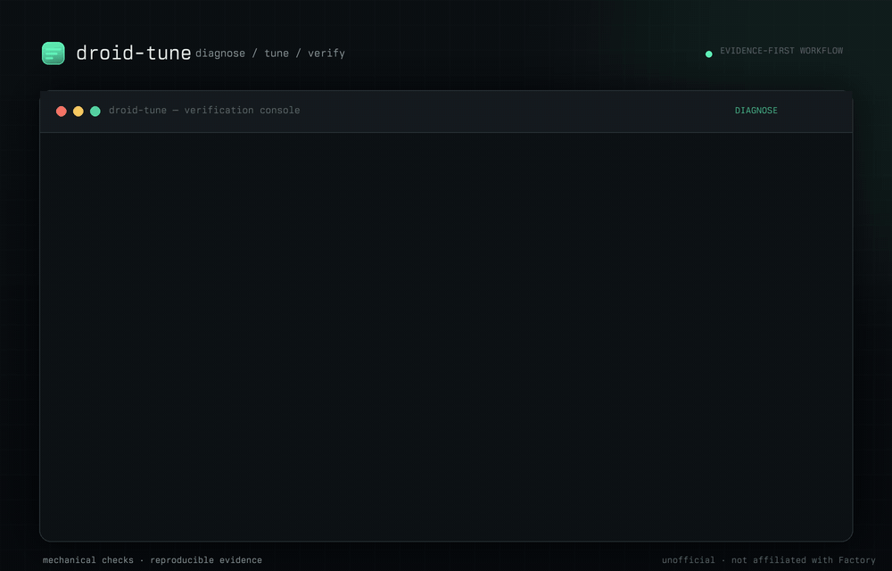

# Droid Tune-Up



**Grade the commit, not the narration.**

## It caught four models doing the work and never shipping it

On `t004-git-surgery`, four different models repaired the git history exactly
as asked — inspected the log, fixed `add`/`multiply`, dropped `JUNK.txt`,
checked the behavioral contract — and then **never ran `git commit`**.

**7 of 8 attempts submitted nothing.** The working tree looked right. The
transcript read like success. A grader that inspects file contents or diffs
would have passed all seven.

droid-tune scores the task the way the task was written: the contract says
*commit your result on `main`*, so an uncommitted result is `NO_SUBMISSION`.
That single distinction is the whole point of the harness — agents narrate
completion far more reliably than they achieve it, and anything that grades
narration will overstate them.

> One `nemotron-3.5-lightning-free` attempt did commit, and passed. The failure
> is near-universal in this suite, not absolute.

An open-source diagnostic, tuning, and verification toolkit for
[Factory Droid](https://docs.factory.ai): evidence packs, isolated trials, and
claims that never outrun their data.

> **Unofficial community project. Not affiliated with Factory.**
> "Factory Droid" is referenced as the measured product, nominative use only.

**Status: M5 infrastructure complete** — diagnostics, isolated trials, the
seven-task tri-force suite, versioned pricing, frozen native-Droid baseline
bundles, and preregistered claims are live. The first paid native baseline has
not been run; `baseline` requires explicit spend confirmation. See
[`PLAN.md`](PLAN.md).

## Results

In this suite, on 2026-08-19, the original M4 flake check observed
**29/40 `VERIFIED_PASS`** across five original tasks and four OpenCode Zen
free routes, at **$0**. Full matrix, lineage notes, and limitations:
[`docs/m4-flake-check-2026-08.md`](docs/m4-flake-check-2026-08.md).

| task | hy3-free | laguna-s-2-1-free | nemotron-3-5-lightning-free | nemotron-3-ultra-free |
| --- | --- | --- | --- | --- |
| `t002-slugify` | PASS, PASS | PASS, PASS | PASS, PASS | PASS, PASS |
| `t003-path-canonicalize` | PASS, timeout, PASS | timeout | PASS, timeout | PASS, PASS |
| `t004-git-surgery` | no-sub, no-sub | no-sub, no-sub | PASS, no-sub | no-sub, no-sub |
| `t005-agents-md-compliance` | PASS, PASS | PASS, PASS | PASS, PASS | PASS, PASS |
| `t007-rename-symbol` | unknown, PASS | PASS, PASS | PASS, PASS | PASS, PASS |

### Reproduce it from a fresh clone

That full sweep lives under `runs/`, which is gitignored — so it is *not*
something you can check. This is: **`demo-pack/` contains 23 real, unmodified
evidence packs** from that sweep, sanitized only for absolute paths. Both
reporting tools read it directly, so you can regenerate real numbers with no
Droid install, no credentials, and no network:

```sh
git clone https://github.com/sainzs/droid-tune.git && cd droid-tune
node scripts/results-table.js --runs-dir demo-pack --title demo-pack
node scripts/flake-report.js  --runs-dir demo-pack
```

That prints, byte for byte:

<!-- BEGIN:DEMO-TABLE -->
### demo-pack

| task | hy3-free | laguna-s-2-1-free | nemotron-3-5-lightning-free | nemotron-3-ultra-free |
| --- | --- | --- | --- | --- |
| `t003-path-canonicalize` | PASS, timeout, PASS | timeout | PASS, timeout | PASS, PASS |
| `t004-git-surgery` | no-sub, no-sub | no-sub, no-sub | PASS, no-sub | no-sub, no-sub |
| `t007-rename-symbol` | unknown, PASS | PASS, PASS | PASS, PASS | PASS, PASS |

**13/23 VERIFIED_PASS (57%)** across 3 tasks x 4 routes.

1 further trial(s) never reached the model (1 unknown) and are excluded from the pass rate rather than counted as failures.
<!-- END:DEMO-TABLE -->

`node scripts/check-demo-table.js` asserts that regeneration still matches
`demo-pack/EXPECTED-TABLE.md`, and CI fails the build if it drifts — so these
numbers cannot rot silently.

The 57% here is lower than the headline 74% because `demo-pack` deliberately
keeps the *hard* tasks: it omits the two tasks that everything passed. It is a
reproducibility fixture, not a summary of the suite.

Counting note: of those 40 trials, 39 actually reached the model (one never
did). Scored over trials that reached the model, the rate is **29/39 (74%)**.
`results-table.js` reports the stricter denominator; the 29/40 figure counts
every attempted trial.

This is a harness result, not a model ranking and not a Droid
cost-optimization claim. No paid native baseline has been run.

**Not every advertised free route works.** A serial probe of all 10 configured
free routes on 2026-08-19 found only 4 usable; the rest failed with 429 rate
limiting, `401 ... is not supported`, a local config gap, or a timeout — all
of which `droid exec` reports as the same `PROVIDER_ERROR`. See
[`docs/free-route-routability-2026-08-19.md`](docs/free-route-routability-2026-08-19.md).

## Install as a Droid plugin

```sh
droid plugin marketplace add https://github.com/sainzs/droid-tune && droid plugin install droid-tune --scope user
```

This exposes `/tune-diagnose`, `/tune-trial`, `/tune-report`, and `/tune-audit`, which wrap the CLI in this repo — no logic duplication.

## Requirements

- Node ≥ 20 (zero runtime dependencies)
- [Factory Droid CLI](https://docs.factory.ai) installed (optional for `--demo`)

## Quickstart

```sh
git clone https://github.com/sainzs/droid-tune.git && cd droid-tune
node bin/droidtune.js diagnose --demo   # zero-install: runs bundled fixtures
npm run check                           # tests + CLI smoke
```

Diagnose your real setup:

```sh
node bin/droidtune.js diagnose          # offline: version, config, sessions
node bin/droidtune.js diagnose --json   # machine-readable
```

Run the included toy task through a configured BYOK model:

```sh
node bin/droidtune.js trial \
  --task tasks/t001-greet-script \
  --model hy3-free \
  --tune m2-smoke
```

**Credentials.** droidtune never asks for a key. It runs `droid exec`, which
reads your `~/.factory/settings.json`; where a `customModels[]` entry
references a credential as `${SOME_VAR}`, that variable must be set in the
environment when you run droidtune. Whatever you already do to put those
variables in your shell is what droidtune needs — an `export` in your shell
profile, a secrets manager, a `direnv` file, or sourcing a file of your own.

`droidtune diagnose` reports exactly which referenced variables are missing,
by name, before a trial can waste a run. Credential *values* are never read,
printed, or written into an evidence pack.

> Earlier revisions of this README told you to `source ~/.factory/env.sh`.
> That is the author's personal file, not a Droid convention — it does not
> exist on your machine unless you created it. It still works as one way to
> set the variables, but it is not a requirement.

Exit codes: `0` clean, `VERIFIED_PASS`, or no violations · `1` faults, another
trial outcome, or violations found · `2` usage error.

## Commands

| Command | What it does |
|---|---|
| `diagnose` | Version stamp, redacted config snapshot, session token/cache dump, faults + harness hints |
| `diagnose --probe [model]` | Live round-trip through `droid exec` on a BYOK custom model; asserts the session lands with disjoint cache fields. Opt-in (spends your BYOK credits/points) |
| `diagnose --demo` | Same pipeline against bundled fixtures — no Droid install needed |
| `trial --task <dir>` | Runs one task end-to-end through `droid exec` (isolated temporary repo, frozen tests copied into a fresh grading copy only after the agent commits) and writes a hash-manifested development evidence pack |
| `baseline --confirm-spend` | Freezes the committed `native-droid-v1` bundle, then runs its six live Droid Core tasks; refuses to start without the confirmation flag |
| `triforce` | Runs oracle, no-op, and cheat controls for every full-layout task without calling Droid |
| `audit <dir>` | Counts process-discipline violations in a pack's recorded transcript — offline, no model call |

Diagnose flags: `--probe [model]` · `--demo` · `--limit <n>` · `--json`.

Trial flags: `--task <dir>` · `--model <id-or-substring>` · `--tune <name>` ·
`--attempt <n>` · `--auto <low|medium|high>` · `--timeout-ms <n>` ·
`--runs-dir <path>` · `--json`.

Common overrides: `--sessions-dir <path>` · `--config <file>` ·
`--droid-path <path>`.

The native baseline intentionally records observed Factory Standard Credits,
not a fabricated USD conversion. No live baseline was run as part of M5
implementation. Its frozen guard is 100k output tokens per trial and 600k
cumulative; a breach stops the remaining tasks. To spend credits deliberately:

```sh
node bin/droidtune.js baseline --confirm-spend
```

### Findings

Every finding has a stable ID. Faults (exit 1): `DT001` droid missing ·
`DT002` plaintext API key · `DT003` unparseable session · `DT004` session
without transcript · `DT005` orphan transcript · `DT006` no token usage despite
messages · `DT007` sessions dir missing · `DT-P00x` probe failures.
Hints (advisory, evidence-linked): `DT101` coding-endpoint tool-call risk ·
`DT102` newer GLM available · `DT103` high-effort thinking tax ·
`DT104` model slots burning Factory credits.

## How it uses Droid

- Reads Droid's own telemetry: `~/.factory/sessions/<encoded-cwd>/<uuid>.settings.json`
  (`tokenUsage`, cache fields, tags, provider lock) and `.jsonl` transcripts.
- `--probe` drives `droid exec` headless with a custom model, tagging the
  session (`--tag droidtune-probe`) so probe runs are self-identifying and
  excluded from your session aggregates.
- `trial` drives a task through `droid exec`, records the tagged Droid session,
  extracts the committed patch, grades it against tests the agent never saw,
  and freezes the artifacts under `runs/<tune>/<task>/attempt-N/`.
- `baseline` freezes the bundle, task/verifier hashes, redacted-config hash,
  Droid version, pricing table, and claim IDs before its first live trial.

## Evidence packs

Evidence packs include provenance, instruction, redacted config snapshot, event
ledger, transcript when Droid emitted one, committed patch, frozen tests,
results, usage, errors when present, and a SHA-256 manifest. Local development
packs under `runs/` are gitignored.

M5 can add a versioned `pricing.json`: exact USD token cost for supported
DeepSeek V4 tables, exact zero for the frozen Zen-free table, or observed
Factory Standard Credits for native Droid. Unknown routes and stale tables fail
closed. Development packs remain ineligible when any required artifact is
absent. No transcript, verifier provenance, or pricing snapshot means no claim.

## Process audit

Grading says whether the commit was right. `droidtune audit` says what the
session *did* on the way there, by scanning the transcript a pack already
carries — zero model calls, zero network:

```sh
node bin/droidtune.js audit runs/<tune>/<task>/attempt-N   # one pack
node bin/droidtune.js audit runs/<tune>                    # per-trial table + totals
```

| Category | Fires when |
|---|---|
| `claim-without-coverage` | assistant text asserts verified/works/done/passes/fixed with no check command in the preceding 8 tool events |
| `stall` | an identical command is re-run 3 or more times |
| `re-derivation` | the same file is edited twice with no check command between the edits |
| `no-test-finish` | the session ran tool calls and never ran a single check command |

Thresholds: `--window <n>`, `--stall-threshold <n>`. `--json` for the raw
aggregation.

Every detector prefers a false negative. Check-command recognition is
deliberately generous (running a workspace file through an interpreter counts,
which is how models actually verify here), claim recognition is narrow and
drops any sentence carrying intent, hedging, negation, or a report that the
check failed, thinking blocks are never treated as claims, and consecutive
edits to one file are read as a single multi-hunk change. A count printed here
should survive being read line by line against the transcript.

The ship-check idea behind `claim-without-coverage` and `no-test-finish` is
adapted from the [J-Space Cognition Suite
V3.6](https://github.com/Tiger3807861189/J-Space-Cognition-Suite-V3.6)
(Apache-2.0) — its "no claim without running the check" rule, applied after the
fact to a transcript instead of to a live agent. Attribution is in the
`lib/audit.js` docstring; no J-Space code is vendored.

> `demo-pack/` was sanitized without transcripts, so `audit demo-pack` reports
> `0/24 auditable` rather than 24 clean rows. To see the auditor produce
> findings from a fresh clone, point it at the committed fixture packs:
> `node bin/droidtune.js audit test/fixtures/audit/packs`.

## BYOK recipe (`${ENV_VAR}` keys, never plaintext)

Droid's `~/.factory/settings.json` supports environment-variable references in
`customModels[].apiKey`. Recommended setup:

```sh
# 1. Keep keys in a 600-mode env file (never committed):
cat > ~/.factory/env.sh <<'EOF'
export ZAI_API_KEY="sk-..."
export OPENCODE_ZEN_KEY="sk-..."
EOF
chmod 600 ~/.factory/env.sh

# 2. Source it from your shell:
echo '[ -f "$HOME/.factory/env.sh" ] && source "$HOME/.factory/env.sh"' >> ~/.zshrc

# 3. Reference in settings.json:
#    { "model": "glm-5.3", "baseUrl": "https://api.z.ai/api/anthropic",
#      "apiKey": "${ZAI_API_KEY}", "provider": "anthropic", ... }
```

`diagnose` treats any non-`${ENV}` apiKey as fault `DT002`. Rotate keys at the
provider console before relying on config snapshots.

## Claims integrity

Nothing is claimed publicly that a stranger cannot reproduce from this repo.
The full protocol lives in [`PLAN.md`](PLAN.md) §8; the verified evidence base
with citations is [`docs/research-2026-08.md`](docs/research-2026-08.md).

## License

[MIT](LICENSE) © Santiago Sainz
